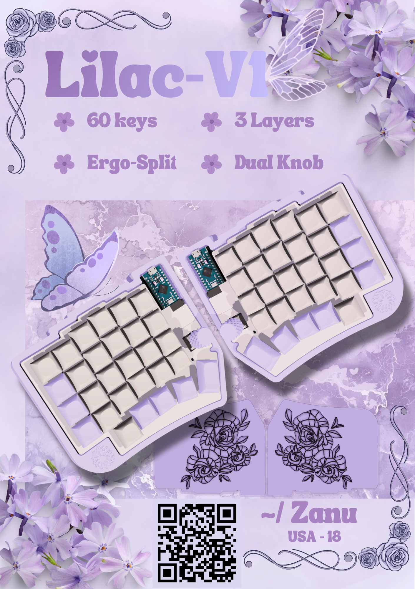
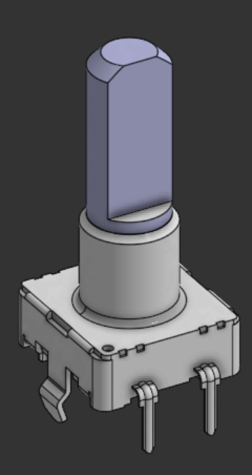
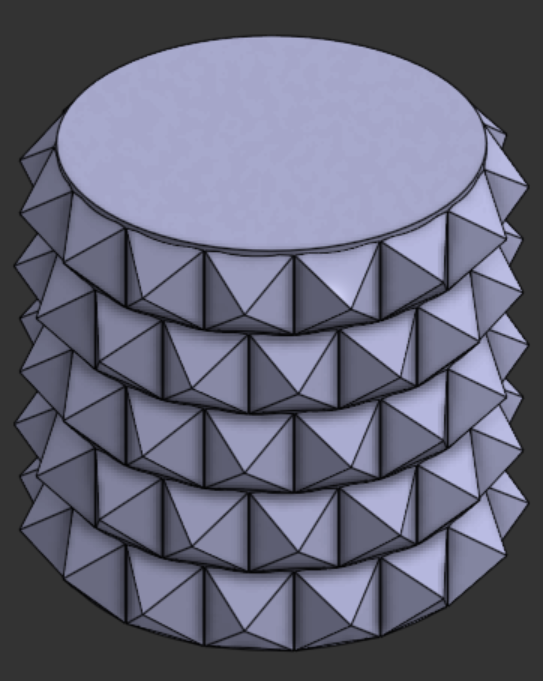
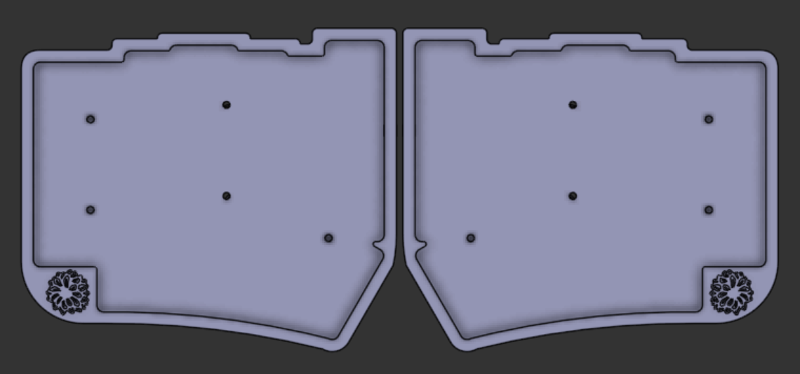

# Lilac-V1
Hello! Welcome to my First Hardware Project. This has been my journey creating my first ever fully custom split ergonomic keyboard!
Lilac-V1 is a Fully Custom 60 Key Split Ergonomic Keyboard for hobbyists. 

> Zine
## Highlights
- Compact
- Portable
- Ergonomic
- Split Keyboard
- 30 - 30 key Split
- 3 Layer firmware
- Dual Rotary Encoders
- Step by Step Guide
## Why I made it!!!
Hi! The original name for this project was "Prak's Ergonomic Journey to Cure his Arthritis!". I have absolutely no experience with electrical related hardware projects so I decided that I might as well start big! Although I did practice a little bit with a small 3x3 macro pad on KiCad I never followed through with making it as I wanted to go big. 
Anyways, I decided to make a custom ergonomic keyboard because I've always seen youtubers and content creators use split ergonomic keyboards and I've always wanted to try it out. I quickly looked up the price online and they're like on average like $200! Now as a soon to be broke college student I in fact do not have 200 bucks lying around for a keyboard I may not even like. I looked deeper into it and it turns out that most of the keyboards out there are custom made. Noticing this, I figured I could probably figure it out myself, and thus, here I am. 
## Basic Overview - Parts
### PCB
- 60 MX Switches
	- Footprint: marbastlib-xp-mx:SW_MX_HS_KS-2P02B01-01_1u
- Used Kailh Polia switch (Cherry MX compatible) STEP file for Render
https://grabcad.com/library/kailh-polia-switch-cherry-mx-compatible-1
- Official Keyboard is Hot Swappable using kailh hot swappable sockets

> Switch Image
- 60 SMD Diodes
	- Footprint: Diode_SMD:D_SOD-523

> Diode Image
- 60 LEDs
	- Footprint: footprints:SK6812MINI-E_fixed

> LED Image
- 2 TRRS Jacks
	- marbastlib-xp-various:CON_MJ-4PP-9

> TRRS Jack Image
- 2 Rotary Encoders
	- Footprint: Rotary_Encoder:RotaryEncoder_Alps_EC11E-Switch_Vertical_H20mm

> Rotary Encoder Image
- 2 Pro Micro Boards
	- Footprint: Arduino:Sparkfun_Pro_Micro

> Pro Micro Image
### Case
- Custom Cases Designed using Onshape
- Rough Dimensions 140mm x 150mm
- Color: #F2EAD1

> Case Image
### Plate
- Custom Plate Designed using Onshape
- Rough Dimensions 130mm x 145mm
- Color: #BBBDE4

> Plate Image
## Basic Overview - Firmware + Layout
### QMK Firmware
### Keyboard Layout Editor NG
https://editor.keyboard-tools.xyz/
Utilized this software to create the keyboard layout and the keyboard holes. 

> Image of keyboard Layout NG JsonFile(6)
Later Used its custom plate generator to make the DXF file for the Plate. 

> Image of custom plate generator
# Credits
- https://github.com/ebastler/marbastlib
- https://grabcad.com/library/arduino-pro-micro-1
- https://github.com/anhthang/dsa-keycap
- [Color Palette inspiration](https://www.etsy.com/listing/1273810417/sofle-keyboard?gpla=1&gao=1&&utm_source=google&utm_medium=cpc&utm_campaign=shopping_us_a-electronics_and_accessories&utm_custom1=_k_Cj0KCQjw7cLOBhDmARIsAGsuA0mPwGLpQfNHffnEbsayU-ZTQRH5wXeHWR-xqP2ohg_lgLdUZgixDLkaAuFpEALw_wcB_k_&utm_content=go_21802013935_169566854118_716586688440_pla-315906365651_c__1273810417_12768591&utm_custom2=21802013935&gad_source=1&gad_campaignid=21802013935&gbraid=0AAAAADtcfRLEGzfBildm0k5Etgt7Pu5Lp&gclid=Cj0KCQjw7cLOBhDmARIsAGsuA0mPwGLpQfNHffnEbsayU-ZTQRH5wXeHWR-xqP2ohg_lgLdUZgixDLkaAuFpEALw_wcB) 
- Written with [StackEdit](https://stackedit.io/).
