# Lilac-V1
Hello! Welcome to my First Hardware Project. This has been my journey creating my first ever fully custom split ergonomic keyboard!
Lilac-V1 is a Fully Custom 60 Key Split Ergonomic Keyboard for hobbyists. 

> Zine
## Highlights
- Compact
- Portable
- Ergonomic
- Split Keyboard
- 30 - 30 key Split
- 3 Layer firmware
- Dual Rotary Encoders
- Step by Step Guide
## Why I made it!!!
Hi! The original name for this project was "Prak's Ergonomic Journey to Cure his Arthritis!". I have absolutely no experience with electrical related hardware projects so I decided that I might as well start big! Although I did practice a little bit with a small 3x3 macro pad on KiCad I never followed through with making it as I wanted to go big. 
Anyways, I decided to make a custom ergonomic keyboard because I've always seen youtubers and content creators use split ergonomic keyboards and I've always wanted to try it out. I quickly looked up the price online and they're like on average like $200! Now as a soon to be broke college student I in fact do not have 200 bucks lying around for a keyboard I may not even like. I looked deeper into it and it turns out that most of the keyboards out there are custom made. Noticing this, I figured I could probably figure it out myself, and thus, here I am. 
## Basic Overview - Parts
### PCB
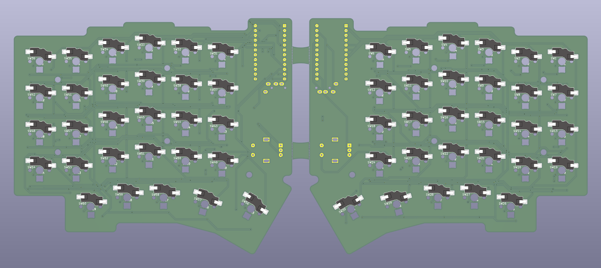
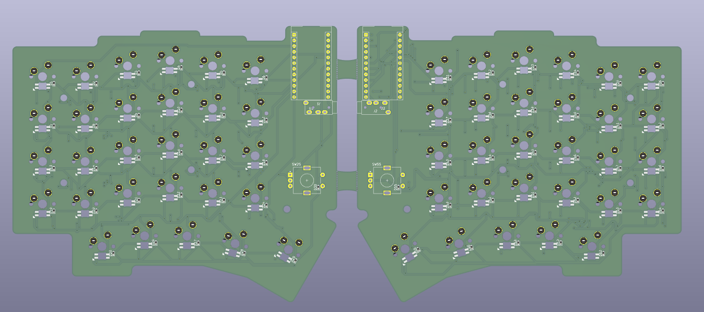

- 60 MX Switches
	- Footprint: marbastlib-xp-mx:SW_MX_HS_KS-2P02B01-01_1u
- Used Kailh Polia switch (Cherry MX compatible) STEP file for Render
https://grabcad.com/library/kailh-polia-switch-cherry-mx-compatible-1
- Official Keyboard is Hot Swappable using kailh hot swappable sockets
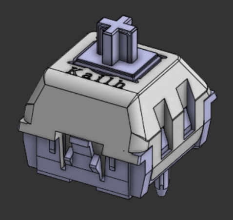

> Switch Image
- 60 SMD Diodes
	- Footprint: Diode_SMD:D_SOD-523
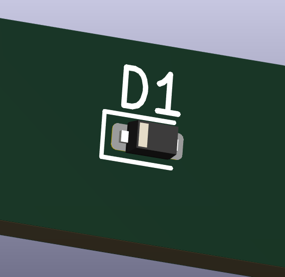

> Diode Image
- 60 LEDs
	- Footprint: footprints:SK6812MINI-E_fixed
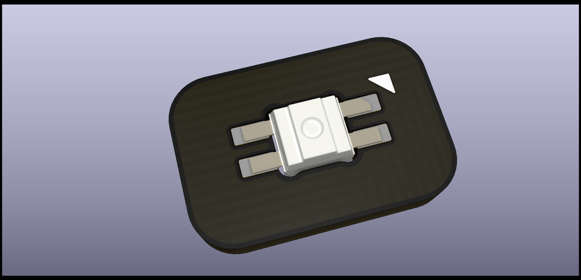

> LED Image
- 2 TRRS Jacks
	- marbastlib-xp-various:CON_MJ-4PP-9
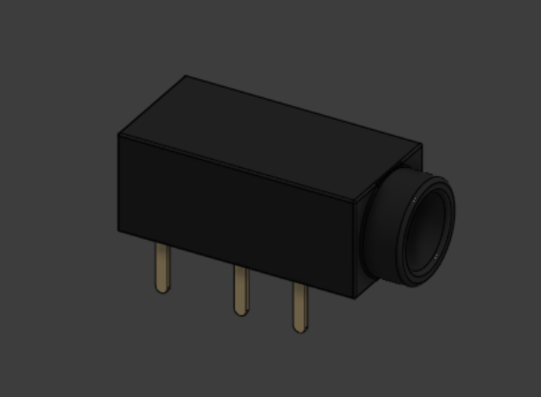

> TRRS Jack Image
- 2 Rotary Encoders
	- Footprint: Rotary_Encoder:RotaryEncoder_Alps_EC11E-Switch_Vertical_H20mm

> Rotary Encoder Image
- 2 Pro Micro Boards
	- Footprint: Arduino:Sparkfun_Pro_Micro
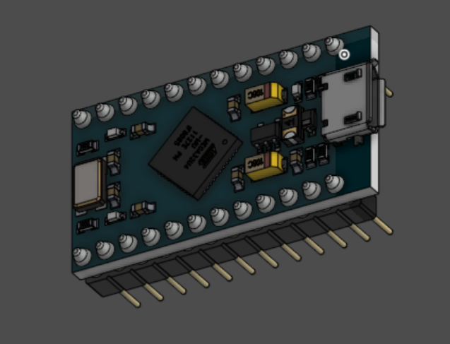

> Pro Micro Image
### Case
- Custom Cases Designed using Onshape
- Rough Dimensions 140mm x 150mm
- Color: #F2EAD1

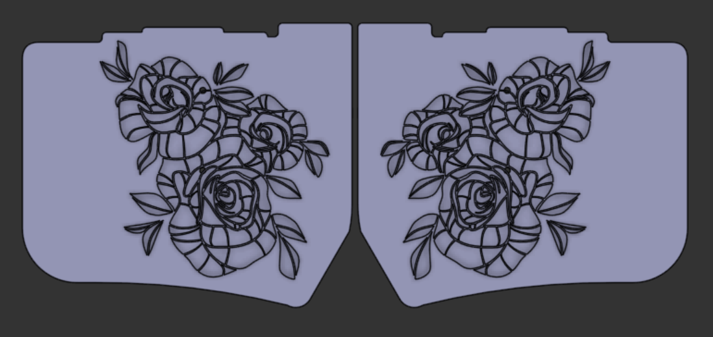

> Case Image
### Plate
- Custom Plate Designed using Onshape
- Rough Dimensions 130mm x 145mm
- Color: #BBBDE4
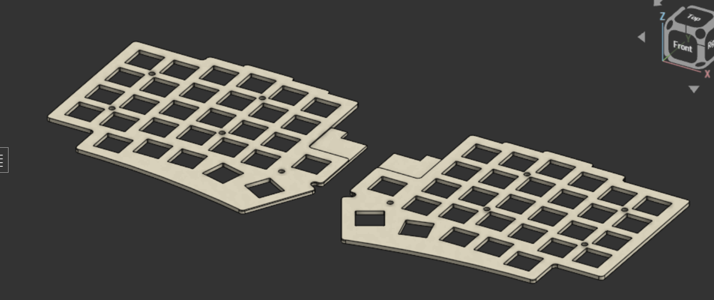

> Plate Image

### PCB Schematics
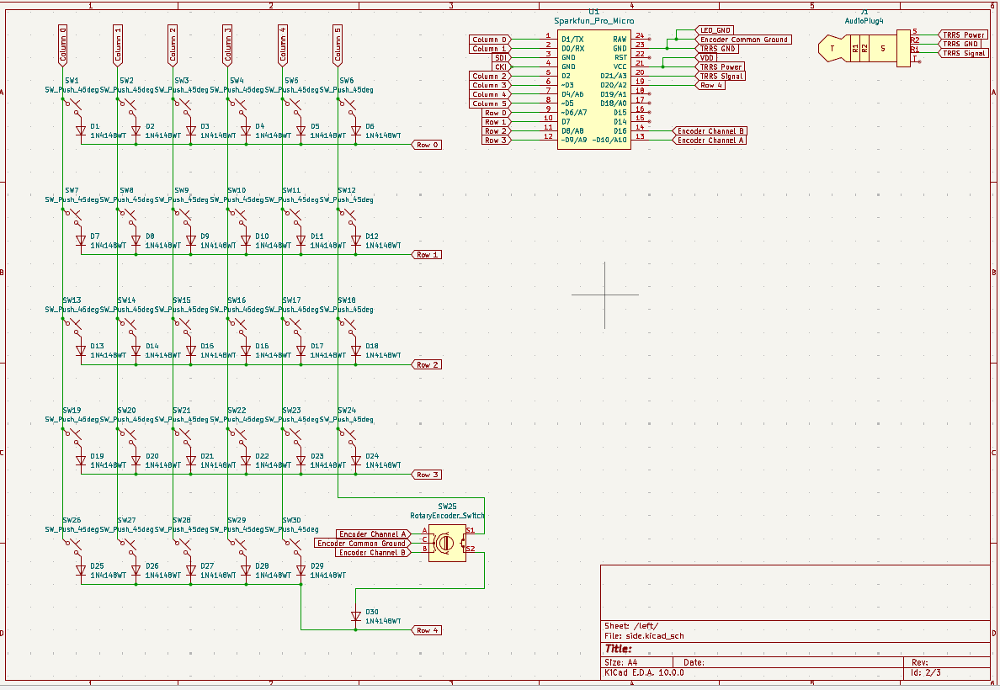

## Basic Overview - Firmware + Layout
### QMK Firmware
### Keyboard Layout Editor NG
https://editor.keyboard-tools.xyz/
Utilized this software to create the keyboard layout and the keyboard holes. 
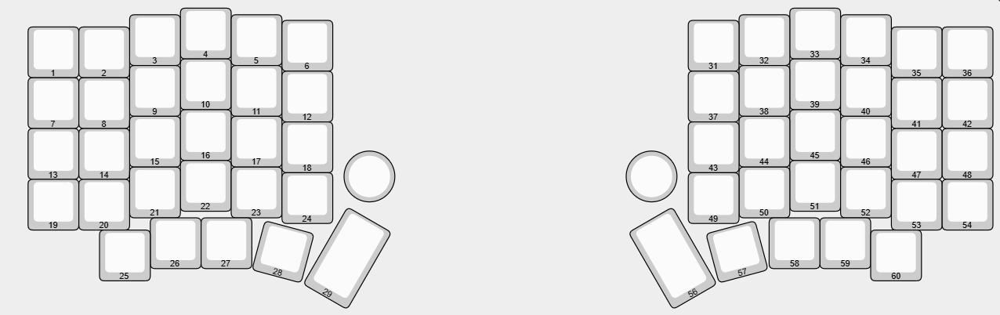

> Image of keyboard Layout NG JsonFile(6)
Later Used its custom plate generator to make the DXF file for the Plate. 
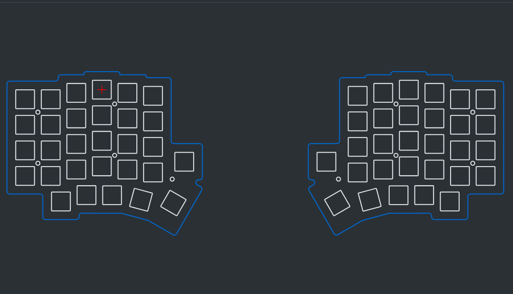

> Image of custom plate generator

# Instructions
### Part List
- [x1 BambuLabs PETG Spool](https://us.store.bambulab.com/products/petg-basic)
- [x2 ProMicro](https://www.amazon.com/OSOYOO-Mega32U4-Leonardo-Module-Arduino/dp/B09TKMM8N5)
- [x2 TRRS Jack - SJ2-3574A-SMT-TR](https://jlcpcb.com/partdetail/CUI-SJ2_3574A_SMTTR/C4991637)
- [x60 kalith hotswappable sockets](https://www.amazon.com/Hot-swap-CPG151101S11-Mechanical-Keyboard-Accessories/dp/B0BVH6M5FP/ref=sr_1_1?crid=T9Y860SOTS1U&dib=eyJ2IjoiMSJ9.EevZxqeUp-BwdM7j_U8_MbAtJ5JfZUOOkAsBMuLzdFA.V6kmxq1wgtNuKFLWIgYij51Bhn6TXikotwipJsFN9ro&dib_tag=se&keywords=kalith%2bhot%2bswappable%2bsockets&qid=1775277449&s=electronics&sprefix=kalith%2bhotswappable%2bsockets,electronics,76&sr=1-1&th=1)
- [x60 Keychron K Pro Banana Tactile Switches](https://www.amazon.com/Keychron-Banana-Linear-Switches-Hot-Swappable/dp/B0BNYY1D9D/ref=sr_1_3?crid=ROB0KDFM2D8F&dib=eyJ2IjoiMSJ9.ywk9OFoUJ08g2rFXxzpWD1aI9Mu7LOdUvPG2807zb6_aAB5ggO2zbkraXT1yKHpIKwS6u7Tdm4p_P94dFEk0Y7JF5nR6ohc1-fwj3wRxx6xOehI9mJMSGmXlyKFDURW8linmgluoQ-Wwi2HjDkleIQptdKfeQ0QpGegJ3YreX4vuz2kEFHtq6pZTtItD-1kKGKfG_hCda-UbG-mlfbd1XYMD1UqB1kgLoc6xWKc3cOQ.AssP9YgcOYW4r9Je2aC5oXVvISoh8Q4JWG3wNFJ5d6s&dib_tag=se&keywords=banana%20switches&qid=1775277570&sprefix=banana%20switches,aps,109&sr=8-3#averageCustomerReviewsAnchor)
- [x2 RotaryEncoder_Alps_EC11E-Switch_Vertical_H20mm](https://jlcpcb.com/partdetail/ALPSALPINE-EC11E15244G1/C370970)
- [SK6812MINI-E LEDS](https://jlcpcb.com/partdetail/OPSCOOptoelectronics-SK6812MINIE/C5149201)

### Required Tools
- [3D Printer](https://us.store.bambulab.com/products/a1?srsltid=AfmBOooBF1VulJOcN0w0Dw9eKBr-6jUI9S0_6fC8T1UrhNsn2X_tcuJB&id=579550514255634444)
- [Soldering Iron](https://www.homedepot.com/p/Weller-Digital-Soldering-Station-WE1010NA/304947077)
- [Brass inserts](amazon.com/FFVRVSS-M2-M3-Threaded-Inserts/dp/B0FWCHPY4F/ref=sr_1_3?crid=1M1V03BBM3MIT&dib=eyJ2IjoiMSJ9.Sjjb3PGrq9pjs0x3RTvJwyMmRcq6Ckucrt-5cHlTGY56BgooaXewumx3JpTy1NCbiV2yIOVJ-vYFUCPGfgFYsK8gKbEKCvLfMyteWEElfPmrq-DAUy6isY1j9VHX2U6Ndi93VoeO0NcqyEsV-mLkOfdkiHu97W_Y5oH1juhhr1yolhXGW-m-8xjGOr2uY8_d8QRuMwjA2gk7tz8GXOoz24xkVfKIJ9iBmXRALR9aVBs.iua-mkHE0n89-bI8siGt-JAvbYwS8CvOuTEmoRfI_3g&dib_tag=se&keywords=brass%20inserts%203d%20printing&qid=1775276856&sprefix=brass%20inserts,aps,133&sr=8-3)

## Step By Step Guide

### Step 1 - Ordering the PCB
- Please look inside of the gerber file and drag the "GerbZip.zip" File into any popular PCB manufacturing service. JLCPCB or PCBway are both great options to manufacture the PCB. 

### Step 2 - Printing the Case 
- Please download and open the "Keyboard_Case.step" file into any slicer software. This project used bambu studio. Some settings to note: 15% infill density, gyroid infill pattern, ironing top surfaces on, fuzzy walls are optional. This project printed the case with PLA however PETG is a great alternative. 

### Step 3 - Printing the Plate
- (Might sound redundant) Please download and open the "Keyboard_Plates.step" file into any slicer software. This project used bambu studio. Some settings to note: 15% infill density, gyroid infill pattern, ironing top surfaces on. This project printed the case with PLA however PETG is a great alternative. 

### Step 4 - Printing the KeyCaps
- Please download and open the "Keyboard DSA 1u.step" file into any slicer software. This project used bambu studio. Copy the 1u key 12 times and prepare to print with a lavender color. Prepare another plate and copy the keys another 46 times to print with a creame color. Some settings to node:15% infill density, gyroid infill pattern, ironing top surfaces on.
  
### Step 5 - Soldering the Components
- Please prepare a safe work enviornemnt with proper ventilation and an N95 mask. Ensure you have a soldering iron, Flux, and possibly solder wick. Start by soldering the SMD LEDs as they are the smallest components before moving to the LEDs and Switches. Rotary Encoders and TRRS Jacks can be left for last.  

### Step 6 - Assembly
- Insert the desired keycaps into the plate now that the sockets are soldered on. For this project I used Kailh Speed Silver switches.
- Push in and solder the Pro Micro controller into the PCB with the USB-C port facing outward. 
- Using 4 10mm M2 screws, assemble the keyboard starting with the case, the pcb, and finally the plate. Ensure that all connections are flush and secured. 

### Step 7 - Firmware
- Using the attached file in the "Firmware" Folder, flash the QMK firmware onto the board.

### Step 8 - Conclusion
- With that, Lilac-V1 is done! Feel free to make any modifications with my design and let me know if I should improve anything! If there are any bugs or issues you encounter please let me know and I will try to fix them ASAP. See yall!

# Credits
- https://github.com/ebastler/marbastlib
- https://grabcad.com/library/arduino-pro-micro-1
- https://github.com/anhthang/dsa-keycap
- [Color Palette inspiration](https://www.etsy.com/listing/1273810417/sofle-keyboard?gpla=1&gao=1&&utm_source=google&utm_medium=cpc&utm_campaign=shopping_us_a-electronics_and_accessories&utm_custom1=_k_Cj0KCQjw7cLOBhDmARIsAGsuA0mPwGLpQfNHffnEbsayU-ZTQRH5wXeHWR-xqP2ohg_lgLdUZgixDLkaAuFpEALw_wcB_k_&utm_content=go_21802013935_169566854118_716586688440_pla-315906365651_c__1273810417_12768591&utm_custom2=21802013935&gad_source=1&gad_campaignid=21802013935&gbraid=0AAAAADtcfRLEGzfBildm0k5Etgt7Pu5Lp&gclid=Cj0KCQjw7cLOBhDmARIsAGsuA0mPwGLpQfNHffnEbsayU-ZTQRH5wXeHWR-xqP2ohg_lgLdUZgixDLkaAuFpEALw_wcB) 
- Written with [StackEdit](https://stackedit.io/).
