# Lilac-V1

A 60-key split ergonomic mechanical keyboard with hot-swappable switches, per-key RGB, and dual rotary encoders. Fully open source.

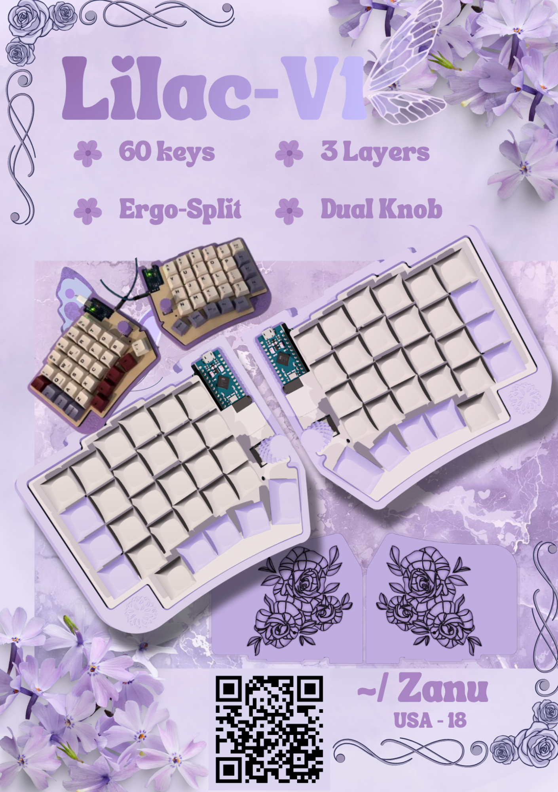

## Contents

- [Overview](#overview)
- [Specifications](#specifications)
- [Gallery](#gallery)
- [Hardware](#hardware)
  - [Bill of Materials](#bill-of-materials)
  - [Required Tools](#required-tools)
  - [PCB](#pcb)
  - [Case and Plate](#case-and-plate)
  - [Schematics and Routing](#schematics-and-routing)
- [Firmware and Layout](#firmware-and-layout)
- [Build Guide](#build-guide)
- [Support and Contributing](#support-and-contributing)
- [License](#license)
- [Credits](#credits)

## Overview

Lilac-V1 is a fully custom split ergonomic keyboard designed from the ground up, including the PCB, case, plate, keycaps, and firmware. It splits 60 keys evenly across two halves so each hand sits at its own natural shoulder width, and adds a rotary encoder per side for volume, scrolling, or any macro you map to it.

Everything needed to build one is in this repository: Gerbers, STEP files, QMK firmware, and a step by step assembly guide. The board is hot-swappable, so switches can be changed at any point without a soldering iron.

The design is aimed at hobbyists building their first custom keyboard, and at anyone who wants a compact, portable, ergonomic daily driver they can modify freely.

## Specifications

| | |
|---|---|
| Layout | 60 keys, 30 + 30 split, column-staggered |
| Switches | Cherry MX compatible, hot-swappable (Kailh sockets) |
| Per-key lighting | 60 x SK6812MINI-E addressable RGB |
| Encoders | 2 x ALPS EC11E rotary encoder with push switch, one per half |
| Controller | 2 x Pro Micro (ATmega32U4), USB-C |
| Interconnect | TRRS (3.5 mm), one jack per half |
| Firmware | QMK, 3 layers, remappable |
| Case | 3D printed, approx. 140 x 150 mm per half, color #F2EAD1 |
| Plate | 3D printed, approx. 130 x 145 mm per half, color #BBBDE4 |
| Mounting | M2 screws into heat-set brass inserts |

## Gallery

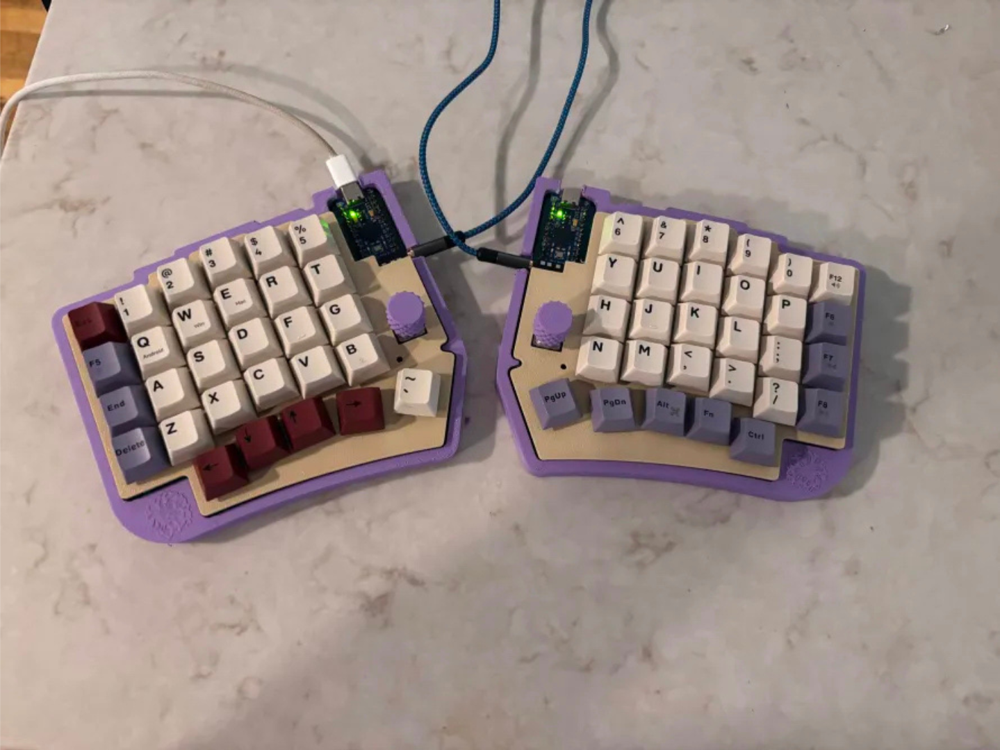

[Build video](https://youtube.com/watch/vKBJXMWnp74?feature=share)

### CAD model

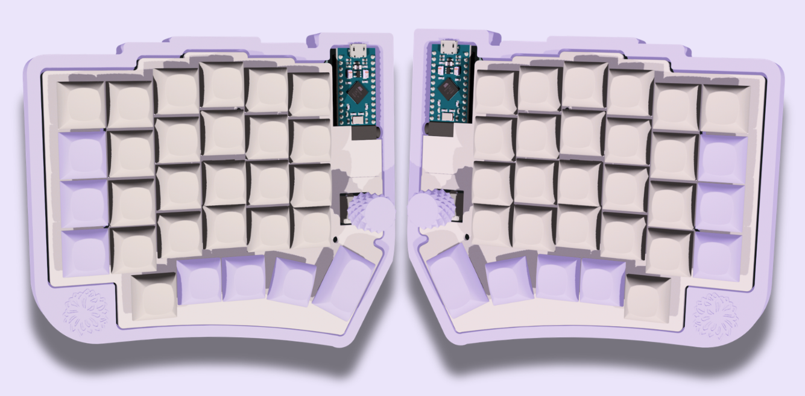

The full parametric assembly is public on Onshape. Fork it to adjust tenting, thickness, or port cutouts.

[Open in Onshape](https://cad.onshape.com/documents/4d8953e5af74fcc880e44e66/w/bef2accd7b1ddfc276551b8b/e/cd08c4a1c934501cd57d1142?renderMode=0&uiState=69ee97f98f8b92d136877fda)

## Hardware

### Bill of Materials

Quantities are for a complete pair of halves.

| Qty | Component | Part / Spec | Source |
|---:|---|---|---|
| 2 | PCB | `GerbZip.zip` in `/Gerber` | [JLCPCB][jlcpcb] or PCBWay |
| 60 | Mechanical switches | Cherry MX compatible | [Keychron K Pro][switches] |
| 60 | Hot-swap sockets | Kailh CPG151101S11 | [Amazon][sockets] |
| 60 | SMD diodes | SOD-523 | Any 1N4148W |
| 60 | RGB LEDs | SK6812MINI-E | [JLCPCB C5149201][leds] |
| 2 | Rotary encoders | ALPS EC11E15244G1, 20 mm vertical | [JLCPCB C370970][encoder] |
| 2 | TRRS jacks | CUI SJ2-3574A-SMT-TR | [JLCPCB C4991637][trrs] |
| 2 | Microcontroller | Pro Micro (ATmega32U4), USB-C | [Amazon][promicro] |
| 8 | Screws | M2 x 10 mm | Hardware store |
| TBD | M2 heat-set inserts | Brass, for 3D prints | [Amazon][inserts] |
| 1 | Filament | PETG or PLA, one spool | [Bambu Lab PETG][filament] |
| 1 | TRRS cable | 3.5 mm, 4 conductor | Any |

Footprint reference, for anyone modifying the PCB in KiCad:

| Component | Footprint |
|---|---|
| Switch | `marbastlib-xp-mx:SW_MX_HS_KS-2P02B01-01_1u` |
| Diode | `Diode_SMD:D_SOD-523` |
| LED | `footprints:SK6812MINI-E_fixed` |
| TRRS | `marbastlib-xp-various:CON_MJ-4PP-9` |
| Encoder | `Rotary_Encoder:RotaryEncoder_Alps_EC11E-Switch_Vertical_H20mm` |
| Controller | `Arduino:Sparkfun_Pro_Micro` |

### Required Tools

- 3D printer, such as a [Bambu Lab A1][printer]
- Temperature-controlled soldering iron, such as a [Weller WE1010NA][iron]
- Flux, solder, solder wick
- Soldering iron tip for installing heat-set inserts
- Tweezers, M2 hex driver, N95 mask, ventilated workspace

### PCB

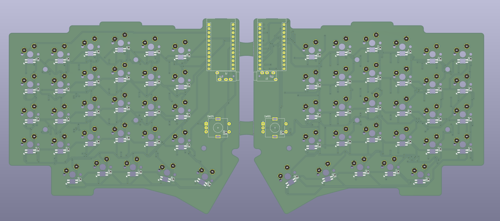
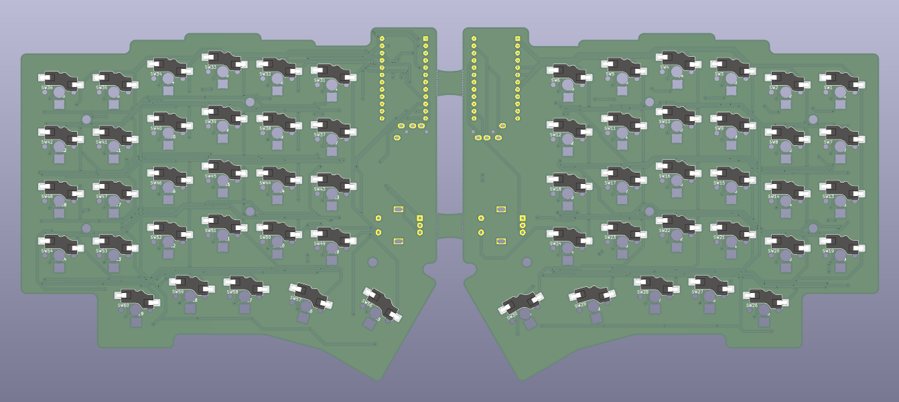

The two halves are mirrored builds of the same board. Component renders below use the [Kailh Polia STEP model][polia] for visualization.

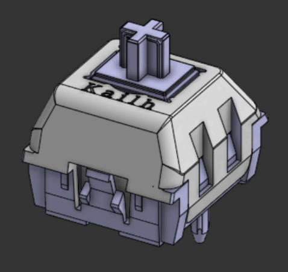
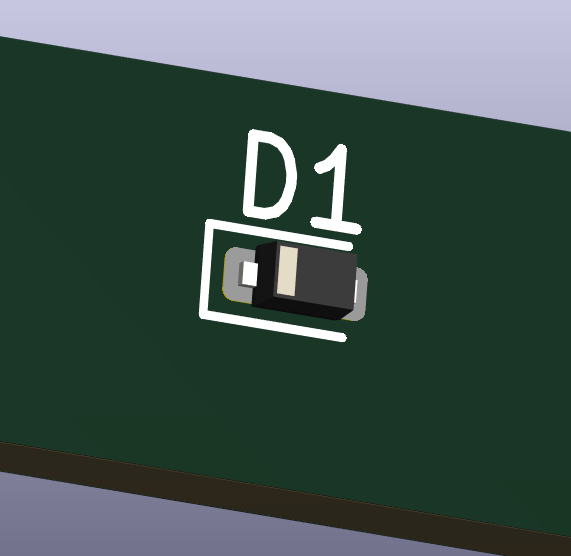
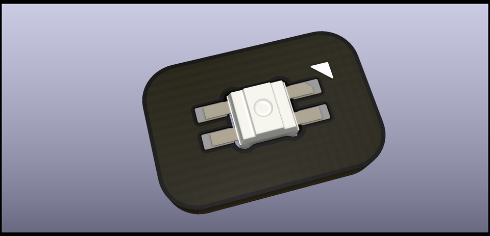
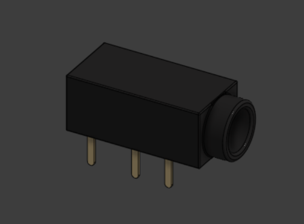
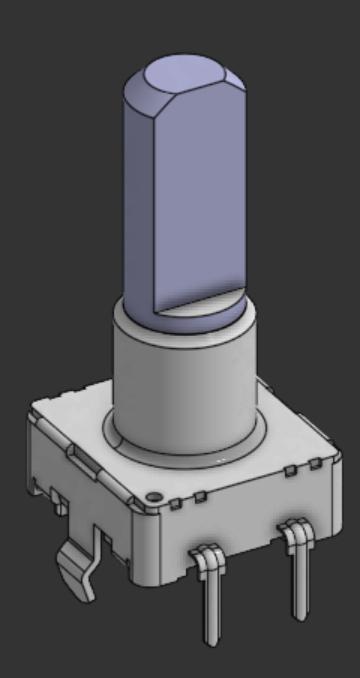
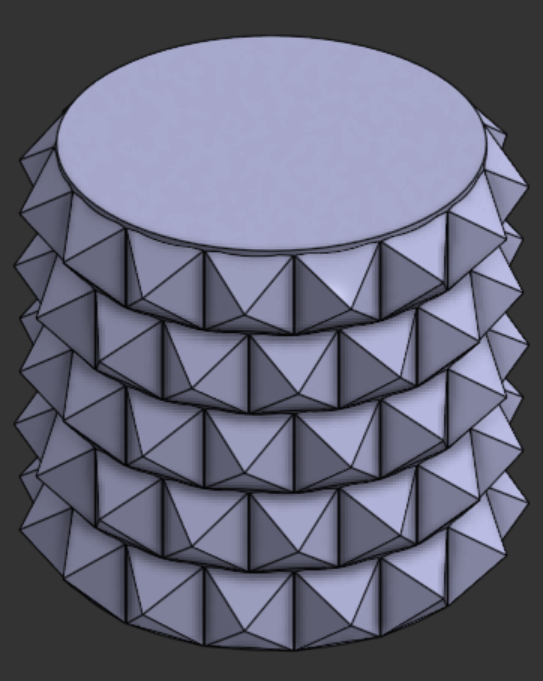
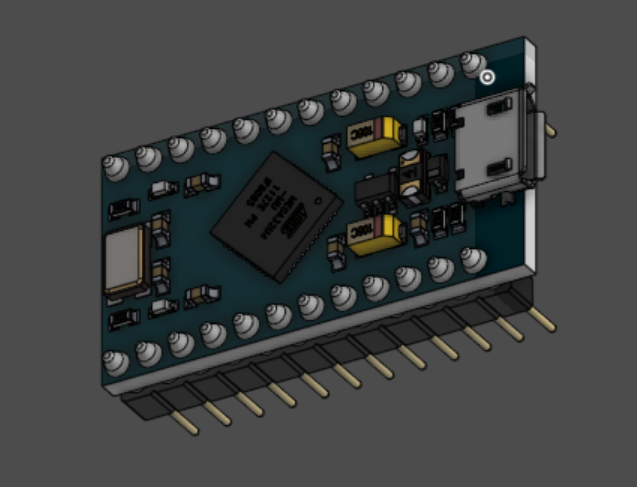

### Case and Plate

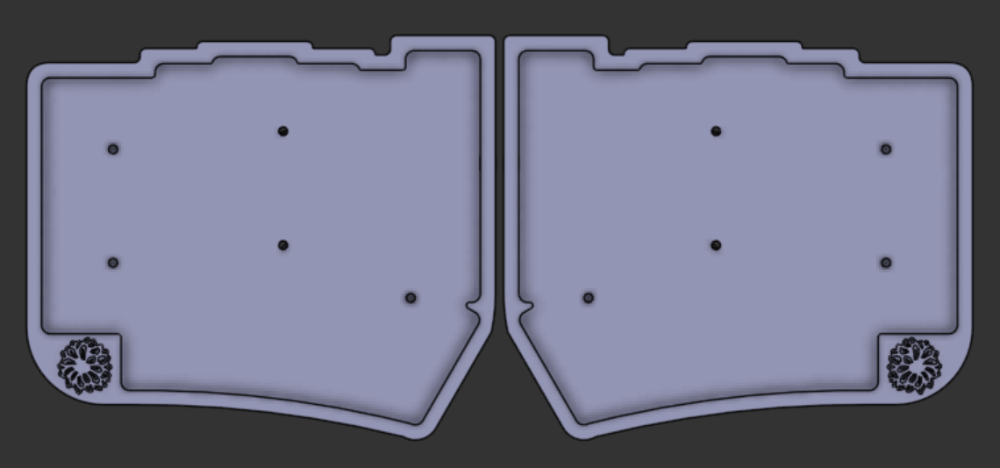
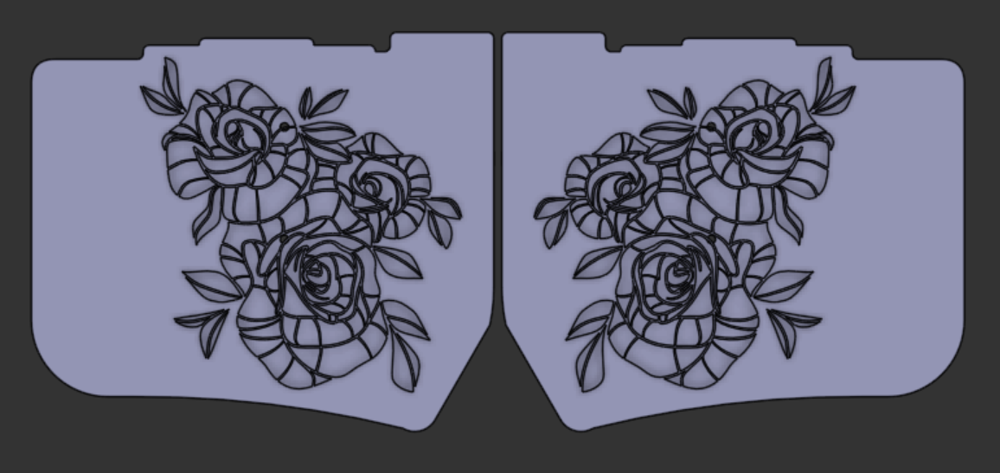
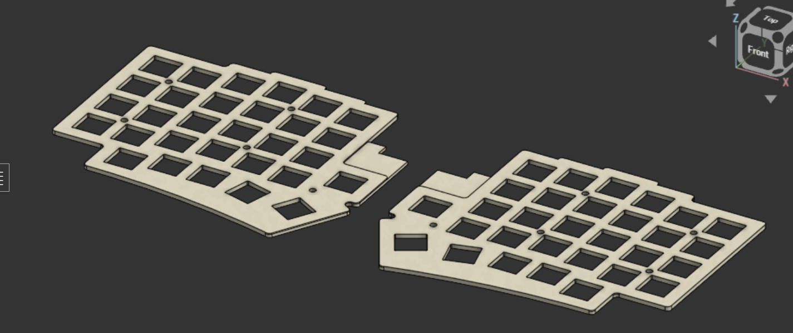

Both are designed in Onshape and print without supports. The plate DXF was generated from the layout file using the [Keyboard Layout Editor NG][kleng] plate generator.

### Schematics and Routing

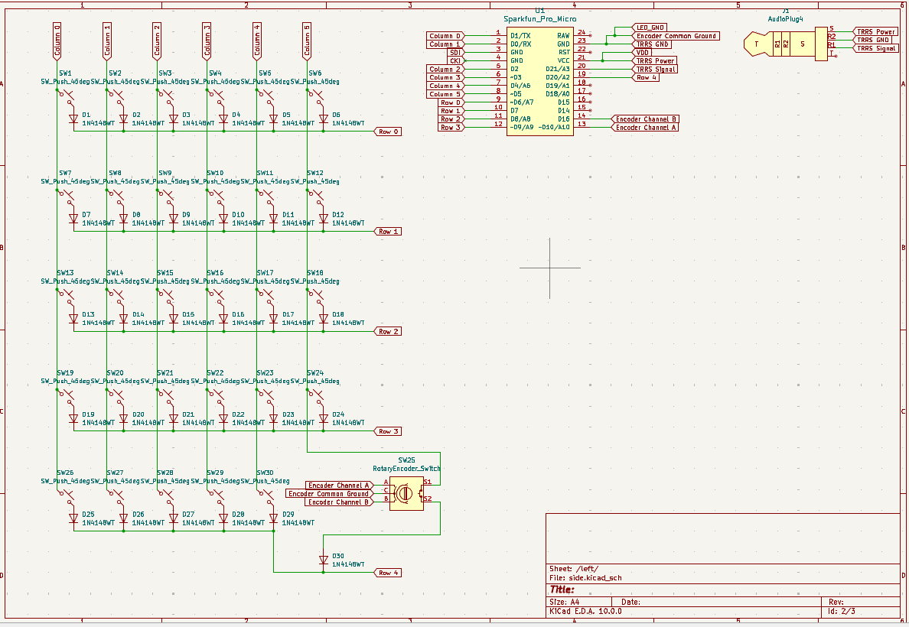
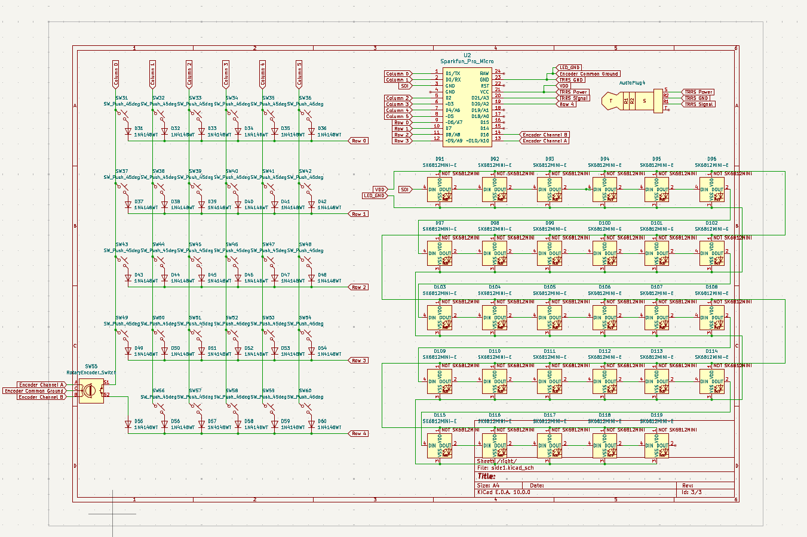
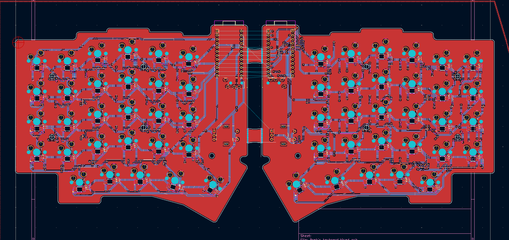

## Firmware and Layout

Lilac-V1 runs QMK with a three layer default map. The compiled firmware and source live in `/Firmware`.

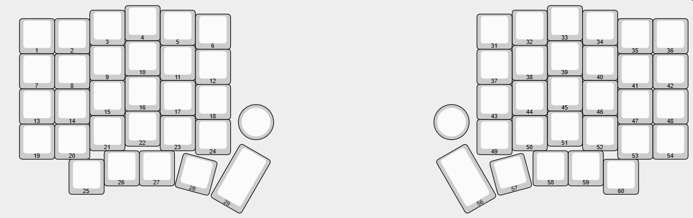
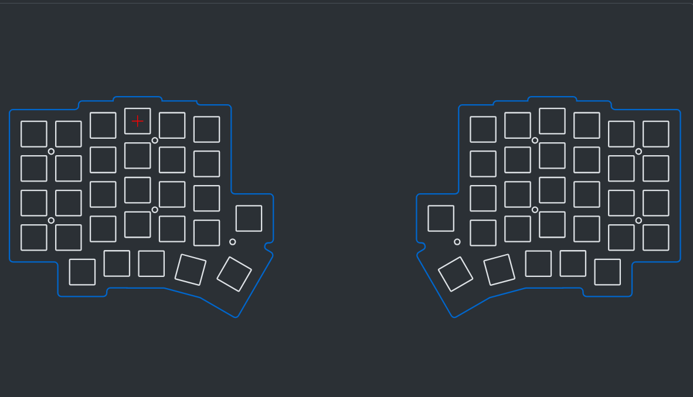

The layout JSON was authored in [Keyboard Layout Editor NG][kleng], which also generated the plate cutouts. Edit the JSON there to fork the layout, then regenerate both the plate DXF and your QMK keymap from it.

## Build Guide

Estimated time is one weekend. Difficulty is intermediate, since SMD soldering is required.

### 1. Order the PCB

Upload `Gerber/GerbZip.zip` to [JLCPCB][jlcpcb], PCBWay, or an equivalent fab. Default 1.6 mm FR-4 with HASL works fine. Order two boards.

### 2. Print the case

Open `Keyboard_Case.step` in your slicer. Recommended profile:

| Setting | Value |
|---|---|
| Infill | 15%, gyroid |
| Ironing | Top surfaces |
| Material | PLA or PETG |
| Fuzzy skin | Optional, walls only |

### 3. Print the plate

Use `Keyboard_Plates.step` with the same profile as above.

### 4. Print the keycaps

Open `Keyboard DSA 1u.step`. Duplicate the key 12 times on a lavender plate, and 46 times on a cream plate. Use the same slicer profile as above.

### 5. Solder the components

Work in a ventilated space with an N95 mask.

Solder smallest to largest, so that larger parts never block access for your iron:

1. SMD diodes (SOD-523), the smallest and hardest to reflow around
2. SK6812MINI-E LEDs, which are heat sensitive, so keep dwell time short
3. Kailh hot-swap sockets
4. Rotary encoders
5. TRRS jacks
6. Pro Micro, with the USB-C port facing outward

Test continuity and flash the firmware before closing the case. Debugging a sealed board is much harder.

### 6. Assembly

1. Press the heat-set brass inserts into the case with a soldering iron tip.
2. Snap the switches through the plate, then seat them into the sockets on the PCB.
3. Fit the keycaps.
4. Stack the case, PCB, and plate, then fasten with M2 x 10 mm screws. Check that every connection sits flush before tightening.

### 7. Flash the firmware

Flash the QMK firmware from `/Firmware` to each half using QMK Toolbox or `qmk flash`. Reset each Pro Micro by shorting RST to GND twice.

### 8. Finish

Connect the halves with a TRRS cable and plug in USB-C.

## Support and Contributing

If you find a bug in the PCB, case, or firmware, please open an issue and I will push a fix as soon as I can verify it. Remixes, layout forks, and pull requests are all welcome. If you build one, I would like to see it.

## License

- Firmware: GPL-2.0, inherited from QMK.
- Hardware (PCB, case, plate, keycaps): see `LICENSE`.

## Credits

- [marbastlib][marbastlib], KiCad footprint libraries
- [Arduino Pro Micro model][promicro-model] on GrabCAD
- [DSA keycap model][dsa] by anhthang
- [Kailh Polia STEP model][polia] on GrabCAD
- [Color palette inspiration][palette]

<!-- Links -->
[jlcpcb]: https://jlcpcb.com/
[switches]: https://www.amazon.com/Keychron-Banana-Linear-Switches-Hot-Swappable/dp/B0BNYY1D9D
[sockets]: https://www.amazon.com/Hot-swap-CPG151101S11-Mechanical-Keyboard-Accessories/dp/B0BVH6M5FP
[leds]: https://jlcpcb.com/partdetail/OPSCOOptoelectronics-SK6812MINIE/C5149201
[encoder]: https://jlcpcb.com/partdetail/ALPSALPINE-EC11E15244G1/C370970
[trrs]: https://jlcpcb.com/partdetail/CUI-SJ2_3574A_SMTTR/C4991637
[promicro]: https://www.amazon.com/OSOYOO-Mega32U4-Leonardo-Module-Arduino/dp/B09TKMM8N5
[inserts]: https://www.amazon.com/FFVRVSS-M2-M3-Threaded-Inserts/dp/B0FWCHPY4F
[filament]: https://us.store.bambulab.com/products/petg-basic
[printer]: https://us.store.bambulab.com/products/a1
[iron]: https://www.homedepot.com/p/Weller-Digital-Soldering-Station-WE1010NA/304947077
[kleng]: https://editor.keyboard-tools.xyz/
[polia]: https://grabcad.com/library/kailh-polia-switch-cherry-mx-compatible-1
[marbastlib]: https://github.com/ebastler/marbastlib
[promicro-model]: https://grabcad.com/library/arduino-pro-micro-1
[dsa]: https://github.com/anhthang/dsa-keycap
[palette]: https://www.etsy.com/listing/1273810417/sofle-keyboard
